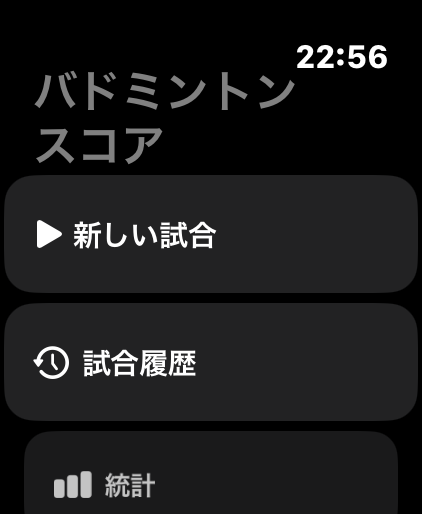
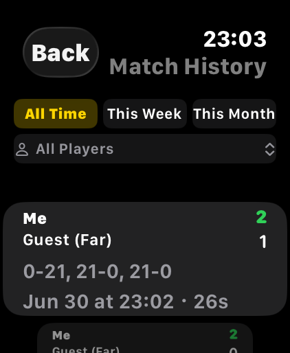
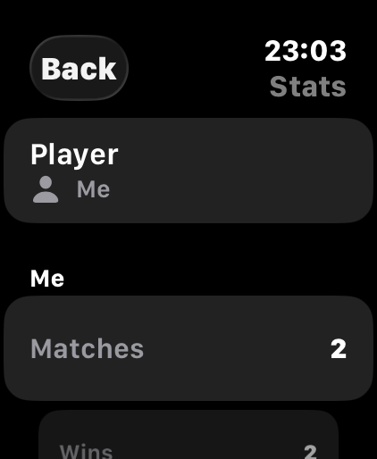

# Badminton Score Tracker

A watchOS app for tracking badminton match scores in real time, right from your wrist.

  
  
  
  

## What it does

- Tap-to-score or Digital Crown scoring, with serve tracking and haptic/spoken feedback
- Best-of-N match formats (11/15/21 points), plus an optional match timer mode
- Player roster with avatars, match history, and per-player / head-to-head stats
- Watch face complication, HealthKit workout logging, and iCloud sync across your own devices
- Localized into English, Japanese, Simplified Chinese, Korean, Indonesian, and Hindi
- VoiceOver-accessible scoring controls

See [`SPEC.md`](SPEC.md) for the full feature spec, and the [Open Issues](SPEC.md#open-issues) table for what's planned next. [`ROADMAP.md`](ROADMAP.md) lays out the long-term architecture plan — shared core package, CloudKit sync, sharing between players, and an iOS companion app.

## Requirements

- Xcode (CI currently builds against Xcode 26.3; watchOS Simulator)
- watchOS 11.4+ deployment target

## Building & running

1. Open `badminton score tracker.xcodeproj` in Xcode.
2. Select the **badminton score tracker Watch App** scheme.
3. Run on a watchOS Simulator or a paired Apple Watch.

Core logic (scoring, persistence, stats) lives in the local `BadmintonCore` Swift package; its tests run with `swift test --package-path BadmintonCore` — no simulator needed. The `badminton score tracker Watch AppTests` bundle remains for app-layer tests (⌘U in Xcode).

## Project structure & conventions

[`CLAUDE.md`](CLAUDE.md) documents the file layout, key models, `@AppStorage` keys, and coding conventions this codebase follows — start there before making changes.

## Development

This codebase is developed primarily with [Claude Code](https://claude.com/claude-code), with human review before anything merges to `main`. Every PR that changes a feature updates [`SPEC.md`](SPEC.md); every PR that changes structure or conventions updates [`CLAUDE.md`](CLAUDE.md) — see [`CLAUDE.md`'s Git Workflow section](CLAUDE.md#git-workflow--must-follow) for the full process.

## License

Apache License 2.0 — see [`LICENSE`](LICENSE).
